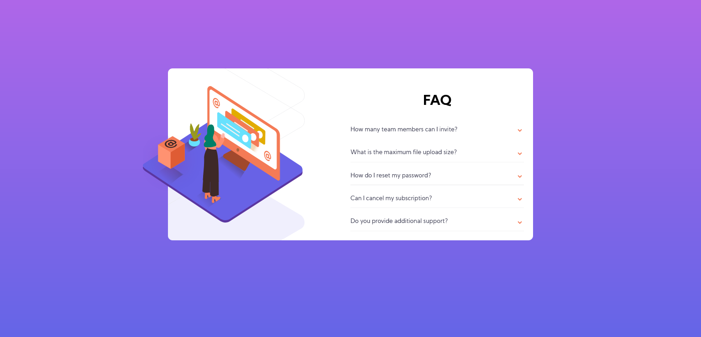

# Frontend Mentor - FAQ accordion card

This is a solution to a Frontend Mentor Challenge, a website that I use to challenge myself to learn HTML/CSS, JavaScript.
Code might not be perfect as I am still learning.

### The challenge

This is a solution to the . 
Frontend Mentor challenges help you improve your coding skills by building realistic projects. 

Users should be able to:

- View the optimal layout for the section depending on their device's screen size
- Expand questions to view the answers

### Built with

- Semantic HTML5 markup
- CSS custom properties
- Flex
- Mobile-first workflow
- Vanilla JavaScript

### Screenshot of the solution

### Live Site

- Live Site URL: (https://chirilaandr.github.io/FAQ-accordion-card/)

## Author

- Linkedin - [@ChirilaAndr](https://www.linkedin.com/in/chirilaandr/)
- Frontend Mentor - [@ChirilaAndr](https://www.frontendmentor.io/profile/ChirilaAndr)
